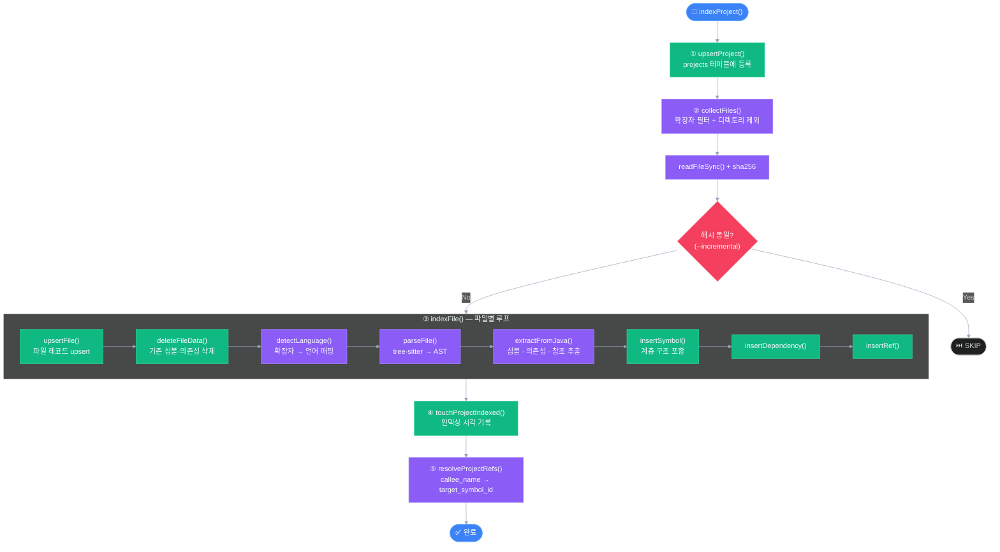
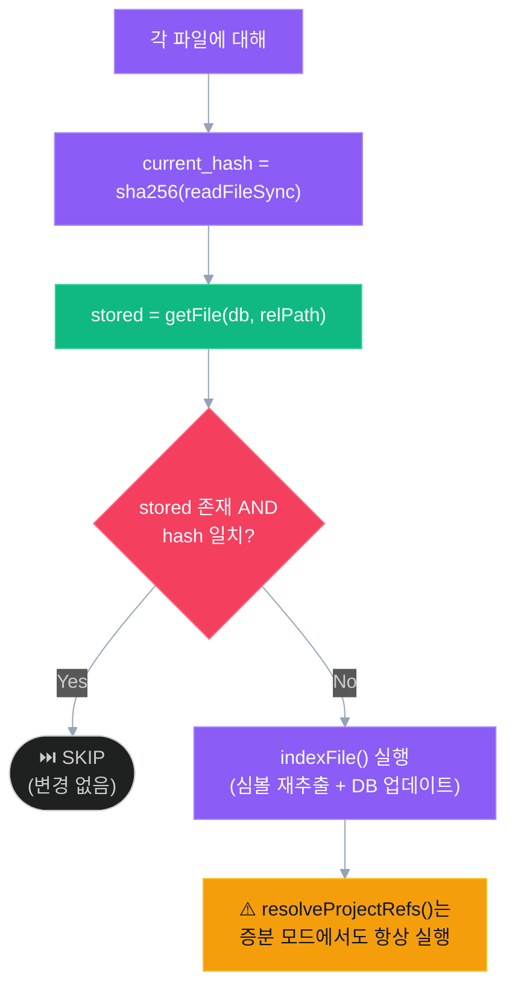

# 인덱싱 엔진

CodeAtlas의 인덱싱 엔진은 tree-sitter를 사용하여 소스 파일을 AST로 파싱하고, 심볼·의존성·참조를 추출하여 SQLite에 저장합니다.

**관련 파일**:
- `src/indexer/indexer.ts` — 오케스트레이터
- `src/indexer/tree-sitter/parser.ts` — 파서 초기화
- `src/indexer/tree-sitter/java-extractor.ts` — Java 심볼 추출기

---

## 인덱싱 파이프라인



---

## 파일 수집 (collectFiles)

### 포함 규칙

- `options.extensions` 에 지정된 확장자만 수집
- 기본값: `['.java']`
- `.codeatlas.yaml`으로 커스터마이징 가능

### 제외 규칙

**항상 제외** (ALWAYS_SKIP):
- `options.skipDirs` 에 지정된 디렉토리
- 기본값: `node_modules`, `build`, `target`, `.gradle`

**루트 한정 제외** (ROOT_ONLY_SKIP):
- `out` 디렉토리 (프로젝트 루트에만 적용)

**자동 제외**:
- `.`으로 시작하는 모든 숨김 디렉토리

---

## 언어 감지 (detectLanguage)

```typescript
// src/indexer/tree-sitter/parser.ts

function detectLanguage(filePath: string): SupportedLanguage | null {
  const ext = path.extname(filePath).toLowerCase();
  if (ext === '.java') return 'java';
  // .kt → 파서 미연결 (계획 중)
  return null;
}
```

언어가 `null`이면 파일 레코드는 생성되지만 심볼 추출은 건너뜁니다.  
이는 미래 언어 지원 확장을 위한 graceful fallback 설계입니다.

---

## Java 심볼 추출기

**파일**: `src/indexer/tree-sitter/java-extractor.ts`

tree-sitter AST를 재귀적으로 순회하며 다음을 추출합니다.

### 추출 대상 심볼 종류 (kind)

| kind | Java 구조 | 예시 |
|------|----------|------|
| `class` | class 선언 | `public class UserService` |
| `interface` | interface 선언 | `public interface UserRepository` |
| `enum` | enum 선언 | `public enum Status` |
| `record` | record 선언 | `public record User(Long id, String name)` |
| `annotation_type` | @interface 선언 | `public @interface CustomEntry` |
| `method` | 메서드 선언 | `public User findById(Long id)` |
| `constructor` | 생성자 | `public UserService(UserRepository repo)` |
| `field` | 필드 선언 | `private final UserRepository userRepository` |

### 추출 데이터

#### 심볼 메타데이터

```typescript
interface ExtractedSymbol {
  name: string;         // 심볼 이름
  kind: SymbolKind;     // 위 테이블 참조
  signature?: string;   // 전체 선언 시그니처
  startLine: number;    // 1-based
  endLine: number;      // 1-based
  modifiers: string[];  // ["public", "static", "final"]
  annotations: string[]; // ["@Service", "@Override"]
  parentName?: string;  // 중첩 심볼의 부모 이름
}
```

**시그니처 생성 예시**:
- 메서드: `public User findById(Long id)`
- 생성자: `UserService(UserRepository userRepository)`
- 필드: `private final UserRepository userRepository`
- 클래스: `null` (이름만 사용)

#### 의존성 (dependencies)

```typescript
interface ExtractedDependency {
  targetFqn: string;  // "com.example.UserRepository"
  kind: 'import' | 'extends' | 'implements';
}
```

Java import, extends, implements 구문에서 추출합니다.

#### 참조 (refs)

```typescript
interface ExtractedRef {
  callerName: string;  // 호출하는 메서드명
  calleeName: string;  // 호출되는 메서드명
  kind: 'calls';
}
```

메서드 호출 구문(`method_invocation`)에서 추출합니다.  
동일 파일 내 참조는 즉시 해석, 교차 파일 참조는 `callee_name`만 저장.

---

## 심볼 계층 구조 저장

중첩된 심볼은 `parent_id`를 통해 계층 구조를 표현합니다.

### 저장 순서

1. 클래스/인터페이스/열거형 → `parent_id = null`
2. 메서드/필드 → `parent_id = 부모 클래스 ID`
3. 중첩 클래스 → `parent_id = 외부 클래스 ID`

### ID 매핑 처리

`indexer.ts`는 삽입 순서에 따라 `symbolIdMap`을 유지합니다:

```typescript
const symbolIdMap = new Map<string, number>(); // symbolName → symbolId

for (const sym of symbols) {
  const parentId = sym.parentName ? symbolIdMap.get(sym.parentName) : undefined;
  const inserted = insertSymbol(db, { ...sym, file_id, parent_id: parentId });
  symbolIdMap.set(sym.name, inserted.id);
}
```

---

## 증분 인덱싱 (--incremental)

파일 내용의 SHA-256 해시를 비교하여 변경 여부를 판단합니다.



**주의**: `resolveProjectRefs()`는 증분 인덱싱에서도 항상 실행됩니다.  
(새 파일이 기존 파일의 미해석 참조를 해결할 수 있으므로)

---

## Kotlin 지원 현황

`tree-sitter-kotlin` 패키지는 설치되어 있으나 파서에 연결되지 않은 상태입니다.

```typescript
// src/indexer/tree-sitter/kotlin-extractor.ts
// 현재 throw Error로 stub 처리됨

// src/indexer/tree-sitter/parser.ts
// detectLanguage('.kt') → null (미구현)
```

`.kt` 파일을 `extensions`에 추가하면 파일 레코드는 생성되지만 심볼은 추출되지 않습니다.

---

## 편집 후 재인덱싱 (reindexFile)

MCP 편집 도구가 파일을 수정한 후 자동으로 호출됩니다:

```typescript
// src/indexer/indexer.ts
export function reindexFile(db: Db, projectId: number, filePath: string): void {
  const relPath = relative(getProject(db, projectId).root_path, filePath);
  indexFile(db, projectId, filePath, relPath);
  resolveProjectRefs(db, projectId);
}
```

write-tools의 3단계 프로토콜의 마지막 단계:  
편집 → 원자적 쓰기 → **재인덱싱** → DB 동기화 완료

편집 후 재인덱싱의 전체 흐름입니다:


---

## 성능 특성

| 지표 | 값 |
|------|-----|
| 소형 프로젝트 (~100 파일) | < 2초 |
| 중형 프로젝트 (~1K 파일) | ~10초 |
| 증분 인덱싱 | 변경 파일 수에 비례 |
| 대형 프로젝트 (~36K 파일) | Gap-3에서 검증 예정 |

트랜잭션으로 묶어 SQLite 쓰기 성능을 최대화합니다:
```typescript
const tx = db.transaction(() => {
  for (const file of files) {
    indexFile(db, projectId, ...);
  }
});
tx();
```
